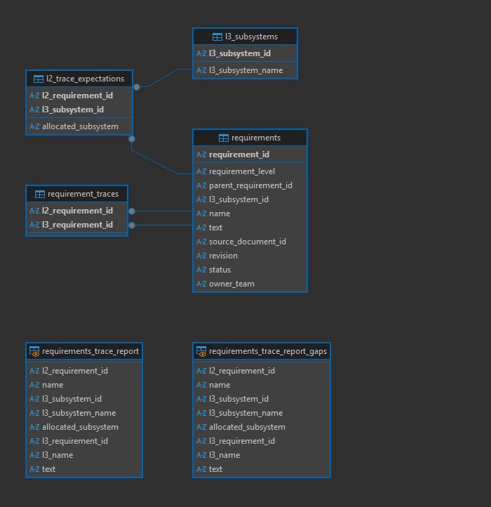
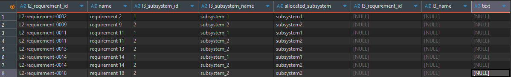
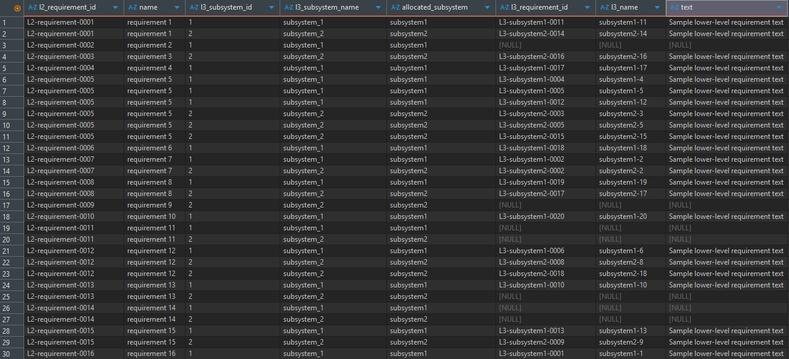

# requirements-traceability-project

Prototype reporting database for consolidating L2 and L3 requirements, expected subsystem allocations, and actual trace relationships into a structured, queryable model.

## Tools Used
- Python (pandas)
- SQLite
- DBeaver
- VS Code
- Git
- Excel / CSV

## Project Structure
- `data_sources/` raw input files
- `data_cleaning/` Jupyter notebooks for cleaning and transformation
- `outputs_clean/` cleaned CSV outputs
- `database/` SQLite database file

## Data Model

The reporting database uses normalized relational tables linking:

-Requirements
-L3 Subsystems
-Expected L2-L3 allocations
-Actual trace relationships

## Example Output

### Gaps Report
Identifies expected subsystem allocations with no traced L3 requirement.

### Full Traceability Report
Shows expected vs actual trace relationships.

## Features
- Cleans raw requirement and traceability files
- Builds structured relational tables
- Creates a full traceability report view
- Creates a gaps-only traceability view

## Business Value
This project demonstrates how manual requirements traceability reporting can be converted into a structured reporting model that supports cleaner querying, easier refreshes, future dashboarding, and potential AI integration.

## Future Improvements
- Automated refresh pipeline scheduled ingestion of updated source files and dashboard refresh
- Power BI dashboard
- Migration to PostgreSQL/MySQL for larger-scale deployment
